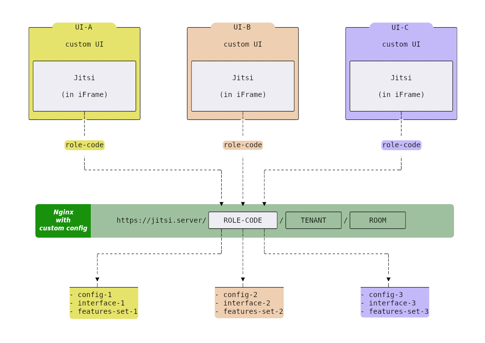

# Jitsi with multiple UI

This repo contains documents/files/config to support multiple UIs on a single
`Jitsi` setup.

## Custom UI

Create a custom user interface for each user group. This UI may be a simple
`HTML` page or a dynamic page generated by a server-side service such as
`nodejs`, `PHP`, etc. No need to host these UI pages on the `Jitsi` server.

`Jitsi` will be embedded into custom user interfaces using
[Jitsi iFrame API](https://jitsi.github.io/handbook/docs/dev-guide/dev-guide-iframe).
This is the first layer of customization and mostly covers customization of
outer space, not Jitsi itself.

Check [custom-ui-a.html](templates/custom-ui/custom-ui-a.html) for a sample
page.

Click
[this link](https://nordeck.github.io/jitsi-multiple-ui/templates/custom-ui/custom-ui-a.html)
to see it in action.

## Custom Jitsi URL

We need a `code` section in `URL` to select a custom feature set and
configuration for `Jitsi`. The last two sections of `path` have a special
meaning for `Jitsi`. The last one is `room` and the other one is `tenant`
(_isolated room group_).

Therefore we need a third section in `path` to put the `code`. So we are using a
`path` with three subsections in our implementation.
